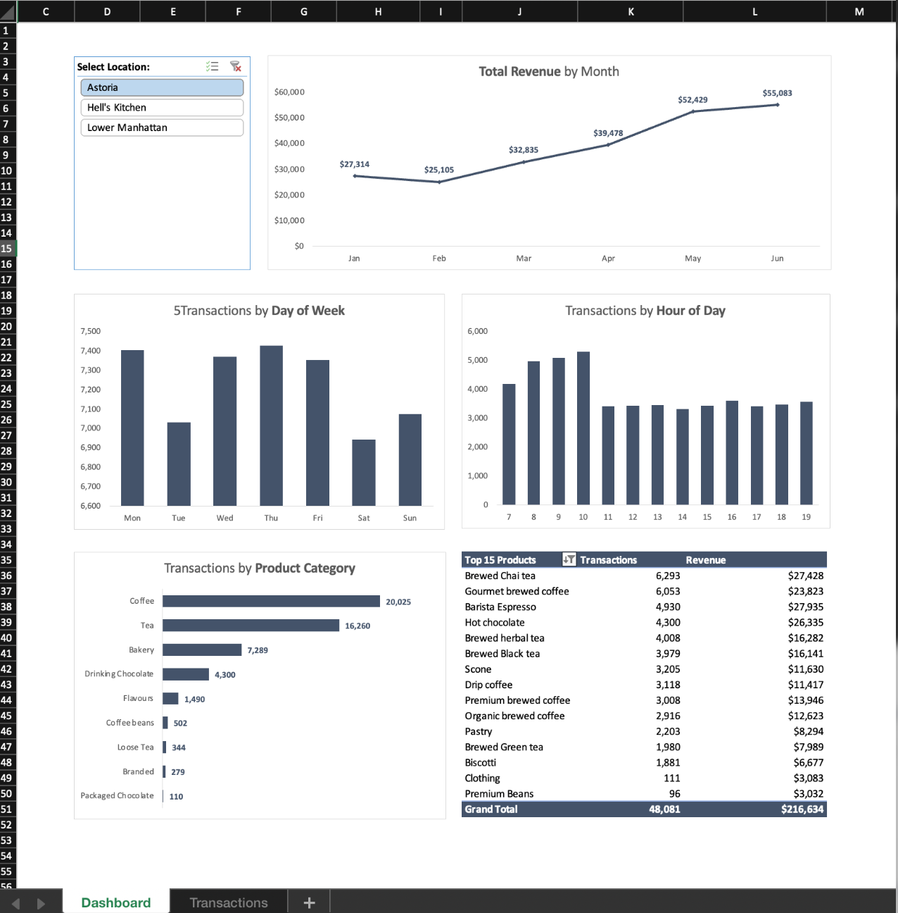
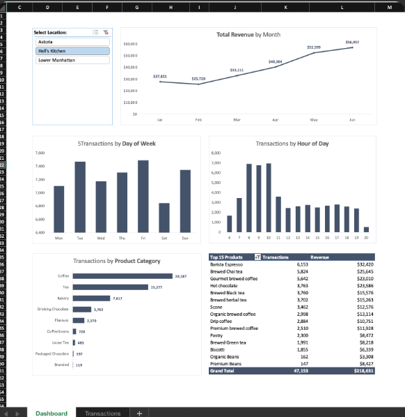
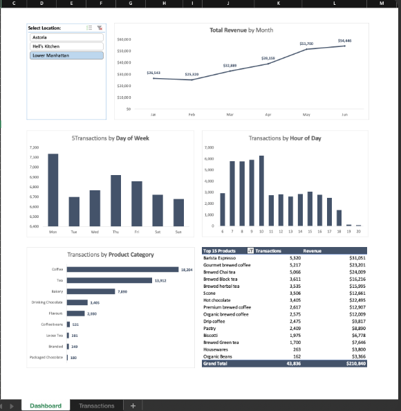

[<- Back to Projects](https://github.com/heesoo-kim97/portfolio-guide/blob/main/README.md)

# ☕ NY Coffee Sales Dashboard

---

## ⏬ Table of Contents

* [Business Case](#business-case)
* [Analytical Approach](#analytical-approach)
* [Interactive Dashboard](#interactive-dashboard)
* [Key Insights](#key-insights)
* [Business Impact](#business-impact)
* [Technologies](#technologies)

---

## Business Case

A coffee retailer operating locations in **Astoria, Hell's Kitchen, and Lower Manhattan** needed greater visibility into sales performance and customer demand across its stores. Transaction patterns varied by location and time of day, making it difficult to determine whether operating hours, staffing levels, and product focus aligned with actual customer behavior.

The objective of this project was to transform transaction-level sales data into an **interactive reporting dashboard** that would help management compare store performance, identify peak demand periods, and make more informed operational decisions.

---

## Analytical Approach

Using **Excel**, transaction-level sales data was organized and analyzed with **PivotTables** to evaluate revenue, transaction volume, customer traffic patterns, and product performance across each location.

An interactive dashboard was developed using **PivotTables, PivotCharts, and Slicers**, allowing users to filter the analysis by location and explore:

* Monthly revenue trends
* Transactions by day of week
* Transactions by hour of day
* Revenue and transactions by product category
* Top-performing products by transactions and revenue
* Location-specific sales performance

The analysis focused on identifying differences in customer demand throughout the day, evaluating whether operating hours aligned with observed traffic, and determining which products and categories contributed most strongly to sales.

---

## Interactive Dashboard

The interactive dashboard uses an **Excel location slicer** to dynamically update revenue, transaction volume, time-of-day demand, product-category performance, and top-selling products. This allows users to compare customer behavior and sales performance across **Astoria, Hell's Kitchen, and Lower Manhattan**.

### Astoria

### Hell's Kitchen

### Lower Manhattan

---

## Key Insights

###  Revenue Trends

Monthly revenue increased across all three locations over the analyzed period, with revenue reaching its highest level in June. This provides a basis for comparing overall sales performance while also examining how customer demand differs by location.

###  Customer Demand Varies by Location

Transaction patterns differed across the three stores:

* **Astoria** maintained relatively consistent transaction volume throughout the day, with demand remaining active into the afternoon and evening.
* **Hell's Kitchen** showed particularly strong activity during the morning and continued to generate transactions throughout the day, supporting its extended operating hours.
* **Lower Manhattan** showed its strongest activity during the morning, followed by a noticeable decline later in the day, suggesting a stronger commuter-oriented demand pattern.

These differences indicate that staffing and operating-hour decisions may benefit from being tailored to each location rather than applying the same approach across all stores.

###  Product Performance

Coffee and tea were the two strongest product categories across the locations. Individual products such as **Barista Espresso, Brewed Chai Tea, and Gourmet Brewed Coffee** consistently appeared among the top-performing products by transaction volume and revenue.

These patterns could help inform inventory planning, product placement, and location-specific promotional strategies.

---

## Business Impact

The dashboard transforms transaction-level sales data into an **interactive, location-specific reporting tool**, allowing management to evaluate store performance without manually reviewing individual transactions.

The analysis could support decisions around:

* **Staff scheduling** — Align staffing levels with peak transaction periods
* **Operating hours** — Evaluate whether store hours match customer demand
* **Inventory planning** — Prioritize high-demand products and categories
* **Promotional strategy** — Focus promotions around popular products and customer patterns
* **Store performance** — Compare revenue and transaction trends across locations

By combining **transactional data, interactive visualization, and business analysis**, this project demonstrates how Excel can be used to transform raw sales data into actionable insights for operational decision-making.

---

## Technologies

 

